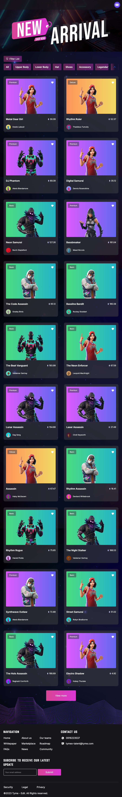

## Tyme assignment

## Setup

This repository is used in the `npx create-turbo` command, and selected when choosing which package manager you wish to use with your monorepo (Yarn).
## Video demo fullflow
- Watch the video here https://drive.google.com/file/d/1jRPwCxLmpRLUj1yhRBgwOnCWpLoUOepP/view?usp=drive_link

## Demo
### Desktop version
 
### Mobile version
- 
## Installation 

Required version
- Node: >= 20


### Build

To build all apps and packages, run the following command:

```
cd tymex-interview-frontend-NguyenQuocDuy
yarn run build
```

### Develop

To develop all apps and packages, run the following command:

```
cd tymex-interview-frontend-NguyenQuocDuy
yarn run dev
```
### Test
```
cd tymex-interview-frontend-NguyenQuocDuy/apps/client
yarn test
```
